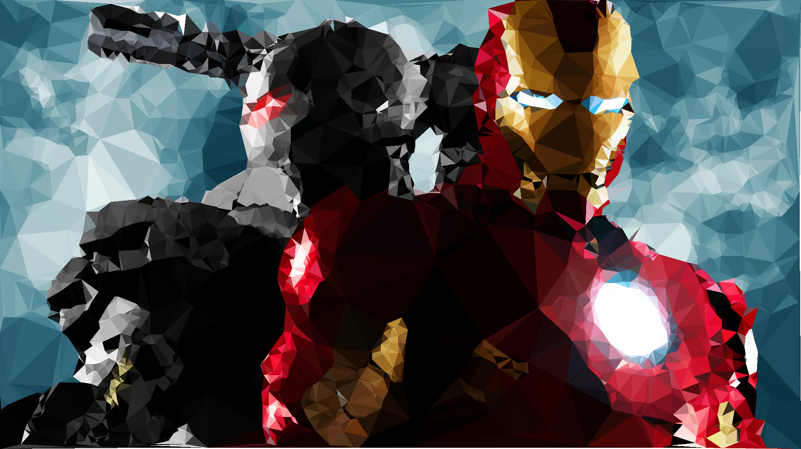
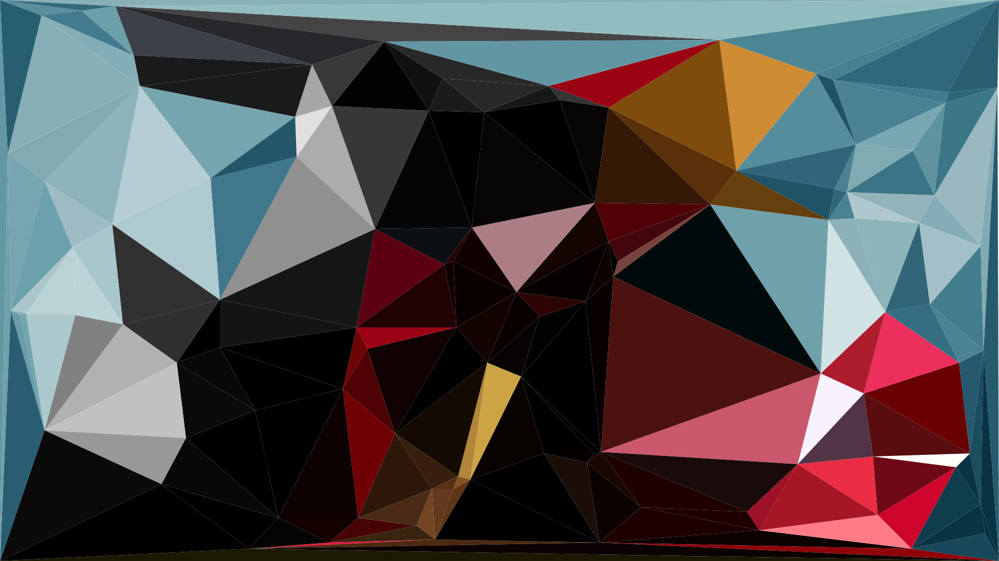
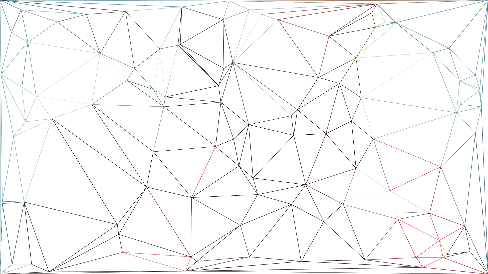
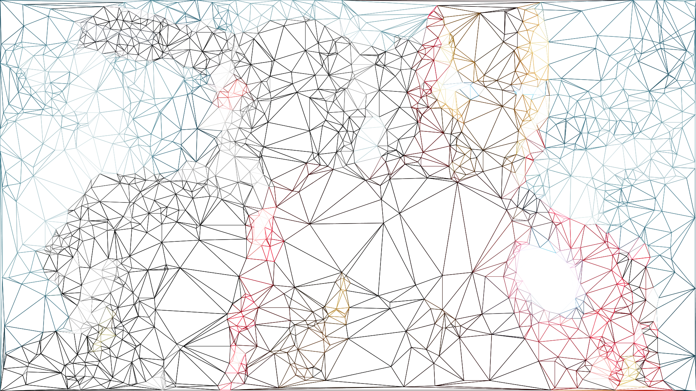

# Low Poly 图片生成器

> 能够生成low poly风格的图片,[Android版本的实现](https://github.com/zzhoujay/LowPolyAndroid)

### 效果图



### 使用方法

```
LowPoly.generate(inputStream,outputStream);
```
或者
```
LowPoly.generate(inputStream, outputStream, accuracy, scale, fill,format, antiAliasing, pointCount);
```

### jar包使用方法

[下载](lib/LowPoly-1.0.jar)

```
java -jar LowPoly-1.0.jar input_filename output_filename
```

或者

```
java -jar LowPoly-1.0.jar input_filename output_filename accuracy scale fill format antiAliasing pointCount
```

### 原理介绍

Low Poly即低多边形，和提高图片精度相反，我们需要降低图片精度来达到low poly的效果

整个算法最主要的就是两步

1. 降低精度
2. 提取图像信息

使用提取到的图像边缘点和一些随机点生成三角形，并着色，即可完成图片的low poly化

#### 降低精度

降低精度采用的是使用三角形粗化像素点的方法，具体实现使用Delaunay算法，具体实现参见`Delaunay.java`

如果单纯只是降低精度的效果图如下：



其中如果去掉填充的颜色（由于点是随机生成的，所以两次生成的点不一样）



取的点越多，生成的图片就会越接近原图片


#### 提取图像信息

采用Sobel算法进行边缘检测，提取图像关键信息，具体参见`Sobel.java`

采集到的点



由于源图片信息量较大采集到的点也就很多，最终效果是由随机的点和采集到的点叠加产生的。


_by zzhoujay_